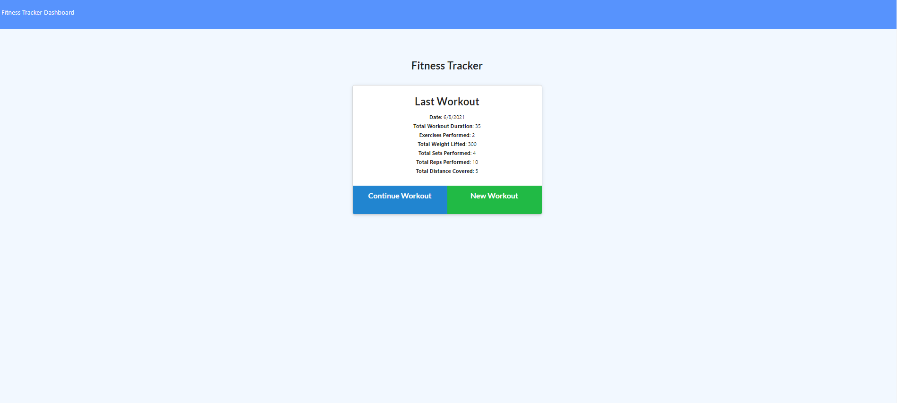
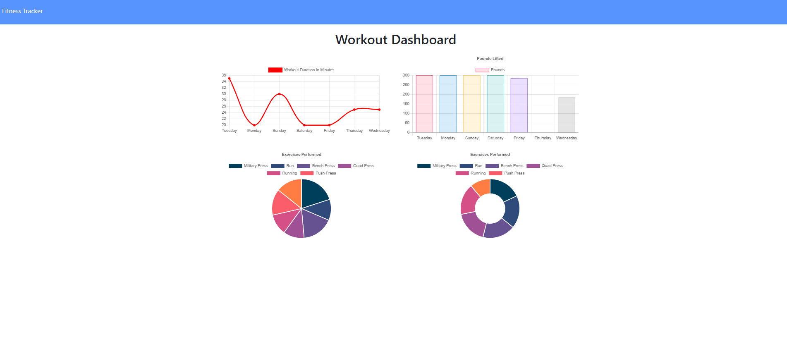

# WorkoutTracker

## Table of Contents

1. [Description](#Description)
2. [Criteria](#Criteria)
3. [Installation](#Installation)
4. [Usage](#Usage)
5. [Contributing](#Contributing)
6. [Issues](#Issues)
7. [Credits](#Credits)
8. [License](#License)
9. [Questions](#Questions)

## Description

We were given a frontend code and told to develop a backend using a Mongo database and a Mongoose schema. The routes are handled with Express.

It took me a while to understand how the aggregate function works. Once I understood that I didn't need to use find, getting the totalDuration to be added on was much simpler. I ran into an issue of trying to create the MongoDB Atlas database late at night and it got stuck. I had to wait until morning to try again to create it.

[Deployed website](https://vast-workout-tracker.herokuapp.com/)

Example picture:

## Criteria

When the user loads the page, they should be given the option to create a new workout or continue with their last workout.

The user should be able to:

  * Add exercises to the most recent workout plan.

  * Add new exercises to a new workout plan.

  * View the combined weight of multiple exercises from the past seven workouts on the `stats` page.

  * View the total duration of each workout from the past seven workouts on the `stats` page.

## Installation

Files must be downloaded from Github. Then, run npm install to get the necessary node modules. Start mongod in a separate window. Use npm run seed to fill information into the database. Last, run npm start.

A ready version is also available at the [deployed website](https://vast-workout-tracker.herokuapp.com/)

## Usage

This is an application where users can create a workout and track the statistics from the exercises they do. After they complete a workout, they can create a new workout. In the dashboard screen, it will show the combined stats of the past 7 workouts.

## Contributing

For contributions, please create a fork to work on then, when done, create a Pull Request.

## Issues

Submit an Issue through Github for any bugs or problems.

## Credits

Assignment was developed as part of the SMU Coding Bootcamp.

## License

Copyright Ashley Wright 2021

This is covered under the <a href='https://opensource.org/licenses/ISC'>ISC</a> license.

## Questions

Feel free to contact through the following with any questions:

Email: ashleyaggie@aol.com

Github: <a href='https://github.com/ashleyaggie'>ashleyaggie</a>